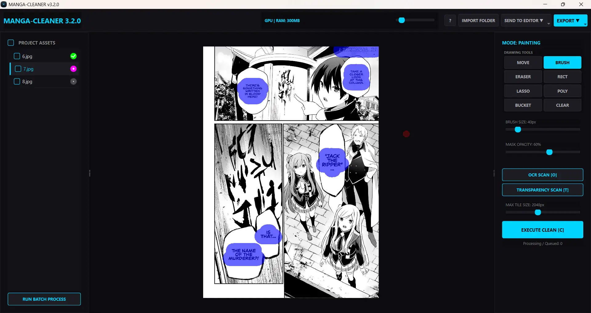
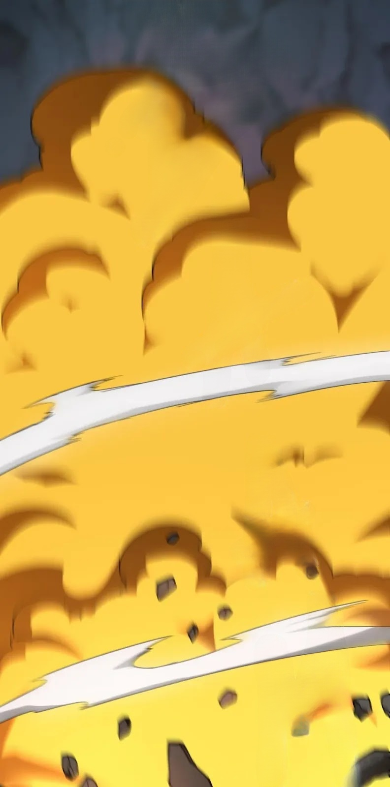

# 🌌 MANGA CLEANER v3.2.0: The Feature-Rich Update
**High-Fidelity AI-Powered Scanlation Restoration Suite**

[](https://github.com/NeTRuNNeRGLiTCH/manga-cleaner/releases)
[](https://www.python.org/)
[](https://github.com/NeTRuNNeRGLiTCH/manga-cleaner/releases)

Building upon the modular "Studio" engine introduced in v3.0.0, **Manga Cleaner v3.2.0** delivers a massive expansion to your cleaning toolkit. This update brings in many Quality of Life features, more selection tools, native Linux support, and new workflows to make scanlation faster and more precise than ever.

---

## 🖥️ Studio Preview (v3.2.0 UI)

*Featuring the Obsidian Dark Theme, the new two-column tool layout, and live file-queue locking.*

---

## ✨ What's New in v3.2.0

The evolution from v3.0.0 to v3.2.0 focuses heavily on giving you granular control over your masks and workflow:

*   **Expanded Toolkit:** We've added a **Polygonal Lasso** for precise geometric selections and a **Bucket Fill** tool that intelligently analyzes your mask layer. 
*   **Pro Canvas Controls:** Navigate like a pro. Zoom in/out with `Alt + Scroll`, pan the image smoothly, draw perfectly straight lines using `Shift + Click`, and dynamically resize your brush on the fly with `Alt + Right-Click Drag`.
*   **Transparency Scanning [T]:** Instantly detect and mask transparent/alpha areas with a single keystroke.
*   **Photopea Integration:** Don't have Photoshop? v3.2.0 introduces a seamless bridge to **Photopea** (the free web editor). Cleaned pages and originals are injected directly into your browser as layered documents.
*   **Linux Support:** The standard CPU edition now officially supports native execution on Linux environments!
*   **Smart Queue UI:** The file list now displays real-time status icons and padlocks, so you always know exactly which pages the background AI is actively processing.
*   **Mask Opacity Slider:** Dynamically adjust the visibility of your red mask overlay without altering the underlying data.

---

## 💎 Core Engine Features

*   **Resolution-Invariant Tiling:** Our Dynamic ROI Engine utilizes "Snap-to-8" reflection padding to process ultra-high 4K+ resolutions without downscaling. The output remains 1:1 perfectly sharp with no Gaussian blurring at the seams.
*   **Advanced AI Core:** High-frequency heatmap OCR for pinpoint text detection, paired with an ONNX-quantized LaMa core for ultra-fast, seamless inpainting.
*   **Hardware Optimized:** The GPU package provides real-time cleaning for NVIDIA devices (~900MB), while the Ultra-Lite CPU edition (~260MB) is perfectly pruned for laptops and integrated graphics.

---

## 📸 Before & After Comparison

| Original Scan | AI Restored (v3.2.0) |
| :---: | :---: |
|  |  |
|  |  |

---

## 📦 Version Comparison: GPU vs. CPU

| Feature | ⚡ CUDA GPU Edition | ☁️ Standard CPU Edition |
| :--- | :--- | :--- |
| **Ideal For** | High-end NVIDIA Gaming PCs | Laptops & Integrated Graphics |
| **Package Size** | ~900MB (Optimized) | ~260MB (Ultra-Lite) |
| **Cleaning Speed** | Instant / Real-time | 3-8 seconds per page | (takes time to load model first)
| **Hardware** | NVIDIA GPU (CUDA Required) | Any modern x64 Processor |

---

## 🎨 Professional Studio Features
*   **Batch Engine:** Process entire chapters in one click. Load -> Auto-Scan -> AI Clean -> Export.
*   **Selection Toolkit:** Added professional **Rectangular Selection** and **Lasso Tools** for manual mask refinement.
*   **Photoshop® Bridge:** Direct COM Interop. Cleaned pages are injected directly into Adobe Photoshop as layered documents.
*   **Integrated Help System:** A built-in manual and shortcut legend for a zero-friction learning curve.

---

## ⌨️ Professional Shortcuts

Master the studio workflow with these refined v3.2.0 keybinds:

| Key | Action |
| :--- | :--- |
| `[O]` | Auto-Detect Text Bubbles (OCR Scan) |
| `[T]` | Auto-Detect Transparent Areas |
| `[C]` | Execute AI Clean (Inpainting) |
| `[B] / [E] / [M]` | Equip Brush / Eraser / Move Tools |
| `[R] / [L] / [P]` | Equip Rect / Lasso / Poly Tools |
| `[G]` | Equip Bucket Fill Tool |
| `[Shift] + Click` | Draw a perfectly straight line between points |
| `Double-Click` | Commit Polygonal Selection |
| `Alt + Right-Click Drag` | Dynamically Resize Brush (Left: Smaller, Right: Bigger) |
| `Hold [Alt]` | Temporary Erase Mode (for Brush, Rect, Lasso, Poly, Bucket) |
| `Hold [Space]` | Quick Toggle Pan/Move Image |
| `[Ctrl+Z] / [Ctrl+Shift+Z]` | Undo / Redo Manual Mask Painting |
| `[Alt+Z] / [Alt+Shift+Z]`| Undo / Redo AI Clean (Image State) |

---

## 🛠️ Technical Stack (For Developers)
*   **Language:** Python 3.12.7 (Strict OOP Architecture)
*   **GUI:** PySide6 (Qt6) with Obsidian Dark styling.
*   **Processing:** OpenCV 4.11 + NumPy 1.26.
*   **Async Logic:** Multi-threaded QThread workers to maintain 60FPS UI responsiveness during AI tasks.
*   **Telemetery:** Real-time RAM and VRAM monitoring via `psutil` and `onnxruntime` provider telemetry.

---

## 🗺️ Roadmap: The Future of Manga Cleaner
*   **v4.0.0 (Planned):** **AMD GPU Support** via DirectML Execution Providers and some of the community suggestions

---

## 📜 Community & Usage Policy
**Copyright © 2024-2026 NeTRuNNeRGLiTCH. All Rights Reserved.**

This project is built to empower the scanlation community. I want this tool to help you work faster and more professionally.

- **Profit from your Work:** You are 100% free to use this tool to clean manga for your scanlation groups, even if those groups accept donations or work on paid platforms. The output you create is yours.
- **Open for Learning:** You are welcome to study the source code, fork the repo, and modify it for your own personal use or to suggest improvements to this project.
- **Strict Commercial Restriction:** You are strictly prohibited from selling this software, its source code, or any modified versions of it. You cannot "re-skin" this app and put it behind a paywall.
- **Attribution:** While not required, a shout-out to this repo helps the project grow!


---

## ⚙️ Development & Compilation (Source Only)

**1. Clone the Repository:**
```bash
git clone [https://github.com/NeTRuNNeRGLiTCH/manga-cleaner.git](https://github.com/NeTRuNNeRGLiTCH/manga-cleaner.git)
cd manga-cleaner
```

**2. Windows Compilation:**
```cmd
python -m venv venv
.\venv\Scripts\activate
pip install -r requirements.txt pyinstaller
pyinstaller MangaCleaner_CPU_clean.spec --noconfirm --clean
cp -R .\models\ .\dist\MangaCleaner_CPU\models
```

**3. Linux Compilation:**
```bash
docker run --rm -v $(pwd):/workspace -w /workspace python:3.12-bookworm bash -c "
  apt-get update && apt-get install -y libgl1 libglib2.0-0 zip
  python -m venv venv
  source venv/bin/activate
  pip install -r requirements.txt pyinstaller

  pyinstaller --clean MangaCleaner_CPU_linux.spec

  chown -R $(id -u):$(id -g) dist/ build/
"
cp -r ./models/ ./dist/MangaCleaner_CPU/models/
```
